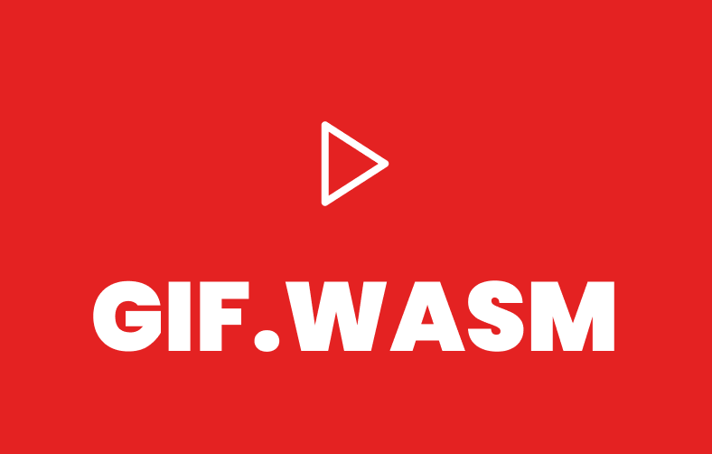

# Video to GIF (WASM)

A privacy-focused, client-side video to GIF converter built with React, WebAssembly, and FFmpeg.

Visit: https://wasm-gif-react.vercel.app/



## 🚀 Overview

**GIF.WASM** is a powerful web application that allows you to convert videos to GIFs directly in your browser. Because it uses **WebAssembly (FFmpeg.wasm)**, your files never leave your device. No uploads, no server-side processing, and complete privacy.

## ✨ Features

- **100% Client-Side**: All processing happens locally in your browser.
- **Multi-Video Support**: Batch process multiple videos at once.
- **Advanced Editing**:
  - Trim and clip specific sections of your video.
  - Create multiple clips from a single source video.
  - Custom resolution and frame rate settings.
- **No Limits (Experimental)**:
  - Optional "Remove Limits" mode in settings.
  - Process unlimited files, larger sizes, and longer durations.
  - _Note: Requires high system resources._
- **Queue Management**: Organize your workspace and process jobs efficiently.
- **Dark Mode**: Sleek UI with generic/dark themes.

## 🛠️ Tech Stack

- **Core**: [React](https://react.dev/), [TypeScript](https://www.typescriptlang.org/), [Vite](https://vitejs.dev/)
- **Styling**: [Tailwind CSS](https://tailwindcss.com/)
- **UI Components**: [shadcn/ui](https://ui.shadcn.com/), [Lucide Icons](https://lucide.dev/)
- **Processing**: [ffmpeg.wasm](https://ffmpegwasm.netlify.app/), [WebAssembly](https://webassembly.org/)
- **State Management**: [Zustand](https://github.com/pmndrs/zustand)
- **Animations**: [Framer Motion](https://www.framer.com/motion/)

## 🏃‍♂️ Getting Started

### Prerequisites

- Node.js (v18+ recommended)
- Bun (preferred) or npm/yarn

### Installation

1.  Clone the repository:

    ```bash
    git clone https://github.com/sahilverma-dev/wasm-gif-react.git
    cd wasm-gif-react
    ```

2.  Install dependencies:

    ```bash
    bun install
    # or
    npm install
    ```

3.  Run the development server:

    ```bash
    bun dev
    # or
    npm run dev
    ```

4.  Open [http://localhost:3000](http://localhost:3000) in your browser.

## ⚠️ Important Note on SharedArrayBuffer

FFmpeg.wasm requires `SharedArrayBuffer` support, which demands specific security headers:

- `Cross-Origin-Embedder-Policy: require-corp`
- `Cross-Origin-Opener-Policy: same-origin`

This project is configured to handle this locally via Vite plugins, but ensure your deployment platform (like Vercel or Netlify) includes these headers.

## 🤝 Contributing

Contributions are welcome! Please feel free to submit a Pull Request.

1.  Fork the project
2.  Create your feature branch (`git checkout -b feature/AmazingFeature`)
3.  Commit your changes (`git commit -m 'Add some AmazingFeature'`)
4.  Push to the branch (`git push origin feature/AmazingFeature`)
5.  Open a Pull Request

## 📄 License

Made with ❤️ by [Sahil Verma](https://sahilverma.dev).
